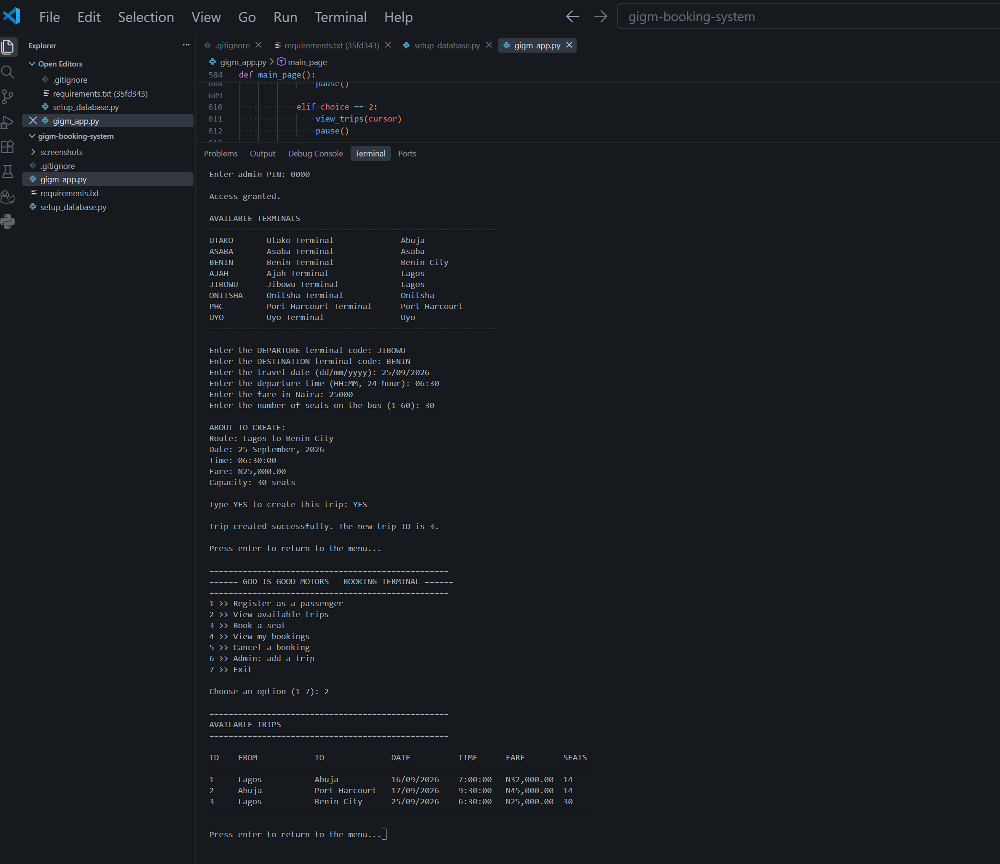
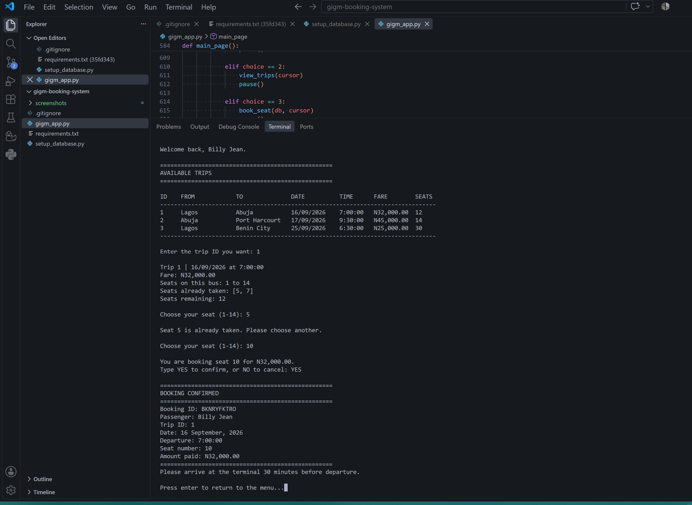
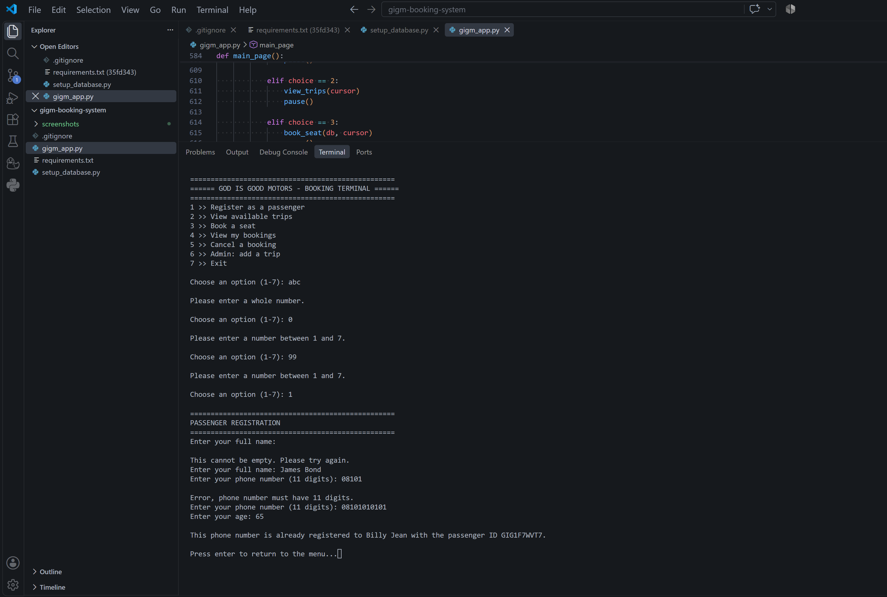

# GIGM Booking System

A command-line seat booking system for an Nigerian interstate bus company, built with Python and MySQL.

## About this project

I am learning Python and SQL. This project extends a class exercise and every input is validated before it reaches the database, the schema enforces its own rules, and no failed operation can leave a partial or duplicate record behind. It is a beginner project and it has limitations (highlighted below).

## Features

1. Register as a passenger
2. View available trips with live seat availability
3. Book a specific seat
4. View your bookings, labelled UPCOMING or COMPLETED
5. Cancel a booking, which frees the seat
6. Admin section for creating trips, protected by a PIN

## Database

Four tables in a MySQL database called `gigm`:

| Table | Holds | Key constraints |
|---|---|---|
| `terminals` | Reference list of GIGM terminals | `terminal_code` primary key |
| `passengers` | Passenger records | `phone` is unique |
| `trips` | Scheduled journeys | Unique on route, date and time; both route columns are foreign keys to `terminals` |
| `bookings` | Seat reservations | **Unique on (trip_id, seat_no)**; foreign keys to `passengers` and `trips` |

## Design decisions

- **Validation helpers loop until the input is usable**, so invalid data never reaches SQL. A menu choice, an age or a date cannot crash the program.
- **All reads and checks run before any write.** The INSERT is the last statement in each feature, followed immediately by `commit()`. Abandoning a flow halfway leaves nothing saved.
- **Every rule is enforced twice**: in Python for a readable message, and in the schema as a constraint that cannot be talked around.
- **`bookings.amount_paid` copies the fare at booking time** rather than joining to `trips.fare`, so raising a fare later does not rewrite old receipts.
- **`UNIQUE (trip_id, seat_no)`** makes double-booking a seat impossible at the database level.
- **Credentials are never in the source.** The MySQL password and admin PIN are read from environment variables.

## Requirements

- Python 3
- MySQL Server running locally
- `pip install -r requirements.txt`

## Setup

1. Set two environment variables on your machine:
   - `MYSQLPASSWORD` — your MySQL root password
   - `GIGM_ADMIN_PIN` — any PIN you choose, for the admin section
2. Restart your terminal or editor so it picks them up.
3. Run `python setup_database.py` once. It creates the database, the four tables and the terminal list. It is safe to run again; nothing is duplicated.
4. Run `python gigm_app.py`.

## Screenshots

## Some lessons learned

- Why parameterised queries (`%s`) are not optional: an apostrophe in a name breaks a string-formatted query, and user input built into SQL by hand is a security hole.
- That `commit()` is what makes a write real, and that putting it after every check has passed stops half-finished records.
- A unique constraint is better for a phone number than on a name.
- Validating input in a helper that loops removes an entire category of crash, rather than handling each one where it occurs.

## Limitations

- No passenger login. The passenger ID is the only credential, and anyone holding it can view or cancel that passenger's bookings.
- Single user. There is no handling of two people booking the same seat at the same moment, beyond the database constraint rejecting the second write.
- Cancelling deletes the booking row, so no cancellation history is kept. Keeping the row would permanently lock the seat under the current unique constraint.
- One shared admin PIN, compared as plain text. No individual admin accounts, no lockout.
- No payments. `amount_paid` records a figure; no money moves.
- Requires a local MySQL server and the `root` account.
- No automated tests. Behaviour was verified by hand.

## Next steps

- Rebuild the same system using classes and inheritance, to practise object-oriented programming.

## Acknowledgement

Emulated a class exercise, done as a class project/assessment. The domain, schema, validation layer, error handling and all features here are my own rework.

---

Built September 2026 while learning Python and SQL. Feedback welcome.